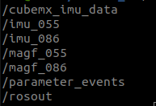

# Get IMU Raw Data from STM32H745ZI-Q 

## Introduction

- This node subscribes to IMU sensor data (BNO055 and BNO086) from micro-ROS at a frequency of 200 Hz. You need to complete installation and using the package first; see the link below.

    **[Integrate-with-BNO055-UROS-UART](https://github.com/CARVER-NEXT-GEN/SparkFun-VR-IMU-Breakout-BNO086-Qwiic-SPI/tree/Integrate-with-BNO055-UROS-UART)**


## Installation

1. **Create a ROS 2 Workspace**:
   - Make a workspace in your home directory: 
     ```bash
     mkdir sensor_ws/
     cd sensor_ws
     mkdir src
     cd src
     ```

2. **Clone the Repository**:
   - Clone into the `src` folder:
     ```bash
     git clone -b Get-IMU-Data https://github.com/CARVER-NEXT-GEN/Odometry-Packages.git .
     ```

3. **Build the Workspace**:
   - From the workspace root:
     ```bash
     cd ~/sensor_ws
     colcon build
     ```

4. **Source the Workspace**:
   - Run:
     ```bash
     source ~/sensor_ws/install/setup.bash
     ```

5. **Add to `.bashrc`**:
   - Auto-source on terminal startup:
     ```bash
     echo "source ~/sensor_ws/install/setup.bash" >> ~/.bashrc
     ```

## Usage
- Run node:
 ```bash
     ros2 run imu_data IMU_get.py
 ```

- Check the topic
     ```bash
     ros2 topic list   
    ```
    <p align="center">
  
    </p>

    - **/cubemx_imu_data:** IMU data from STM32CubeIDE, which store in an float3 array.
    - **/imu_055:** Data from BNO055 as IMU message type.
    - **/magf_055** Data from BNO055 as MagneticField message type.
    - **/imu_086:** Data from BNO086 as IMU message type.
    - **/magf_086** Data from BNO086 as MagneticField message type.